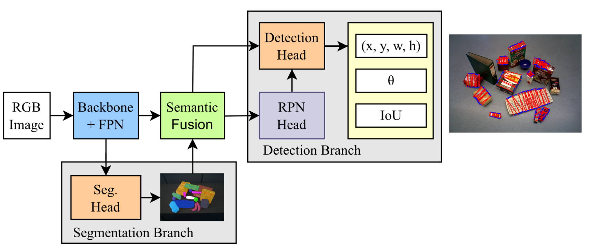

# Grasp CNN
Grasp detection and Semantic Segmentation

adapted from [grasp_det_seg_cnn](https://github.com/stefan-ainetter/grasp_det_seg_cnn.git). Implemented code for Cornell dataset, Semantic Fusion Module and IoU Head.

## Requirements and setup
```
git clone https://github.com/HangQvQ/Grasp_CNN.git
cd Grasp_CNN
conda create -n grasp_cnn
conda activate grasp_cnn
```

To install PyTorch, please refer to https://github.com/pytorch/pytorch#installation.

To install all other dependencies using pip:
```
pip install -r requirements.txt
python setup.py install
```

## Dataset
The OCID_grasp dataset can be downloaded [here](https://files.icg.tugraz.at/d/777515d0f6e74ed183c2/).
The Cornell dataset can be downloaded [here](https://www.kaggle.com/datasets/oneoneliu/cornell-grasp).


### Training
Download weights pretrained on ImageNet [here](https://files.icg.tugraz.at/d/1e84f72c1109485ba9f9/) and copy them into the pretrained_resnet folder.

To launch the training:
```bash
cd scripts
torchrun --nproc_per_node=1 ./scripts/train_det_seg_grasp.py --local_rank=INT --log_dir=LOGDIR CONFIG DATA_DIR DARASET_NAME
```
Training logs, both in text and Tensorboard formats as well as the trained network parameters, will be written 
in `LOG_DIR` (e.g. `ckpt_files_OCID`).
The file `CONFIG` contains the network configuration e.g. `grasp_det_seg/config/defaults/det_seg_OCID.ini`, 
and `DATA_DIR` points to the previously downloaded OCID_grasp splits, e.g. `DATA/OCID_grasp/data_split`.

### Running evaluation

Given a trained network, inference can be run on any set of images using
[scripts/test_det_seg_OCID.py](scripts/evaluate_det_seg_grasp.py):
```bash
cd scripts
torchrun --nproc_per_node=1 ./scripts/evaluate_det_seg_grasp.py --local_rank=INT --log_dir=LOG_DIR CONFIG MODEL_PARAMS DATA_DIR OUTPUT_DIR DATASET_NAME

```
Predictions will be written to `OUTPUT_DIR` e.g. the `output` folder. `MODEL_PARAMS` are pre-trained weights e.g. `ckpt_files_OCID/pretrained/model_last.pth.tar`, 
`DATA_DIR` points to the used dateset splits e.g. `DATA/OCID_grasp/data_split`.